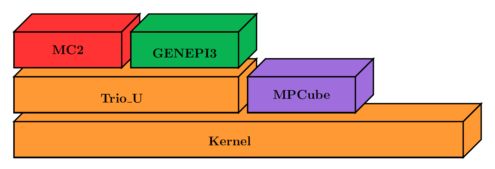
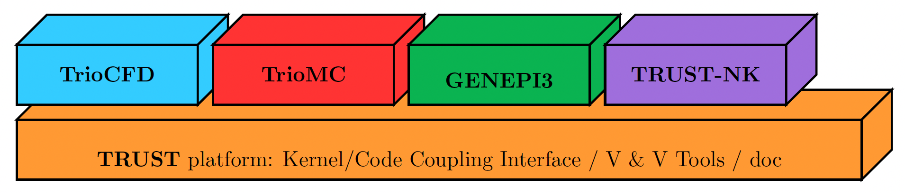

Introduction
============

**TRUST** is a High Performance Computing (HPC) thermal-hydraulic engine for Computational Fluid Dynamics (CFD) developed at the Departement of System and Structure Modelisation (DM2S) of the French Atomic Energy Commission (CEA).

The acronym **TRUST** stands for **TR**\ io\_\ **U** **S**\ oftware for **T**\ hermohydraulics. This software was originally designed for conduction, incompressible single-phase, and Low Mach Number (LMN) flows with a robust Weakly-Compressible (WC) multi-species solver. However, a huge effort has been conducted recently, and now TRUST is able to simulate real compressible multi-phase flows. 

TRUST is also being progressively ported to support GPU acceleration (NVidia/AMD).

The software is OpenSource with a `BSD license <https://github.com/cea-trust-platform/trust-code/blob/master/License.txt>`__, available on GitHub via `this link <https://github.com/cea-trust-platform/trust-code>`__.

You can easily create new project based on **TRUST** plateform. Theses projects are named **BALTIK** projects (**B**\ uild an **A**\ pplication **L**\ inked to **T**\ r\ **I**\ o_U **K**\ ernel).

.. https://github.com/cea-trust-platform/trust-code/blob/master/License.txt

.. https://github.com/cea-trust-platform/trust-code

Before TRUST: a Modular Software Named Trio_U
---------------------------------------------

**TRUST** was born from the cutting in two pieces of **Trio_U** software. **Trio_U** was a software brick based on the **Kernel** brick (which contains the equations, space discretizations, numerical schemes, parallelism...) and used by other CEA applications (see Figure 1).

   Figure 1: Trio_U brick software

.. raw:: html

   

In 2015, **Trio_U** was divided in two parts: **TRUST** and **TrioCFD**.

-  **TRUST** is a new platform, its name means: **TR**\ io\_\ **U** **S**\ oftware for **T**\ hermohydraulics.

-  **TrioCFD** is an open source BALTIK project based on **TRUST**.

Here are some other selected BALTIKS based on the TRUST platform (see Figure 2).

   Figure 2: Selected BALTIKS based on the TRUST platform.

Short History
-------------

**TRUST** is developed at the Laboratory of High Performance Computing and Numerical Analysis (LCAN) of the Software Engineering and Simulation Service (SGLS) in the Department of System and Structure Modeling (DM2S). 

The project starts in 1994 and improved versions were built ever since:

- **1994 :** Start of the project Trio_U

- **1997 :** v1.0 - Finite Difference Volume (VDF) method only

- **1998 :** v1.1 - Finite Element Volume (VEF) method only

- **2000 :** v1.2 - Parallel MPI version

- **2001 :** v1.3 - Radiation model (TrioCFD now)

- **2002 :** v1.4 - LES turbulence models (TrioCFD now)

- **2006 :** v1.5 - VDF/VEF Front Tracking method (TrioCFD now)
 
- **2009 :** v1.6 - Data structure revamped

- **2015 :** v1.7 - Separation TRUST & TrioCFD + switch to open source

- **2019 :** v1.8 - New polyheadral discretization (PolyMAC)

- **2021 :** v1.8.4 - Multiphase problem + Weakly Compressible model

- **2022 ... :** Modern C++ code (templates, CRTP, ...), support GPU (NVidia/AMD), remove MACROS, ...

Data File
---------

To launch a calculation with **TRUST**, you need to write a "data file" which is an input file for **TRUST** and will contain all the information about your simulation. Data files are written following some rules as shown below. But their language is not a programming language, users can’t make loops or switch...

**Note** that:

-  lines between ``# ... #`` and ``/* ... */`` are comments,

- **TRUST** keywords can be highlighted with your file editor via the command line:
   
   .. code-block:: bash

      trust -config gedit|vim|emacs

-  braces ``{ }`` are elements that **TRUST** reads and interprets, so don’t forget them and *put space* *before and after them*,

-  elements between bracket ``[ ]`` are optional.

.. _dataset:

Data File Example: Base Blocks
~~~~~~~~~~~~~~~~~~~~~~~~~~~~~~

Here is the template of a basic sequential data file:

.. code-block:: bash

   # Dimension 2D or 3D #
   Dimension 2

.. code-block:: bash

   # Problem definition #
   Pb_hydraulique my_problem

.. code-block:: bash

   # Domain definition #
   Domaine my_domain

.. code-block:: bash

   # Mesh #
   # BEGIN MESH #
   Read_file my_mesh.geo ;
   # END MESH #

.. code-block:: bash

   # For parallel calculation only! #
   # For the first run: partitioning step #
   # Partition my_domain
   {
      Partition_tool partitioner_name { option1 option2 ... }
      Larg_joint 2
      zones_name DOM
      ...
   }
   End #

.. code-block:: bash

   # For parallel calculation only! #
   # For the second run: read of the sub-domains #
   # Scatter DOM .Zones my_domain #

.. code-block:: bash

   # Discretization on hexa or tetra mesh #
   VDF my_discretization

.. code-block:: bash

   # Time scheme explicit or implicit #
   Scheme_euler_explicit my_scheme
   Read my_scheme
   {
      # Initial time #
      # Time step #
      # Output criteria #
      # Stop Criteria #
   }

.. code-block:: bash

   # Association between the different objects #
   Associate my_problem my_domain
   Associate my_problem my_scheme

.. code-block:: bash

   # Discretization of the problem #
   Discretize my_problem my_discretization

.. code-block:: bash

   # New domains for post-treatment #
   # By default each boundary condition of the domain is already extracted #
   # with names such as "my_dom"_boundaries_"my_BC" #
   Domaine plane
   extraire_surface
   {
      domaine plane
      probleme my_probleme
      condition_elements (x>0.5)
      condition_faces (1)
   }

.. code-block:: bash

   # Problem description #
   Read my_problem
   {

.. code-block:: bash

      {
         # hydraulic problem #
         Navier_Stokes_standard
         {
            # Physical characteristics of medium #
            Fluide_Incompressible
            {
            ...
            # Gravity vector definition #
            gravity Uniform_field 2 0 -9.81
            }

            # Choice of the pressure matrix solver #
            Solveur_Pression solver { ... }

            # Diffusion operator #
            Diffusion { ... }

            # Convection operator #
            Convection { ... }

            # Sources #
            Sources { ... }

            # Initial conditions #
            Initial_conditions { ... }

            # Boundary conditions #
            Boundary_conditions { ... }
         }

.. code-block:: bash

         # Post_processing description #
         # To know domains that can be treated directly, search in .err #
         # output file: "Creating a surface domain named" #

         # To know fields that can be treated directly, search in .err #
         # output file: "Reading of fields to be postprocessed" #

         Post_processing
         {
            # Definition of new fields #
            Definition_Champs { ... }

            # Probes #
            Probes { ... }

            # Fields #
            # format default value: lml #
            # select ’lata’ for VisIt tool or ’MED’ for Salomé #
            format lata
            fields dt_post 1. { ... }

            # Statistical fields #
            Statistiques dt_post 1. { ... }
         }

.. code-block:: bash

         # Saving and restarting process #
         [sauvegarde binaire datafile .sauv]
         [resume_last_time binaire datafile .sauv]

.. code-block:: bash

      # End of the problem description block #
      }

.. code-block:: bash

   # The problem is solved with #
   Solve my_problem

.. code-block:: bash

   # Not necessary keyword to finish #
   End

Basic Rules
~~~~~~~~~~~

There is no line concept in **TRUST**.

Data files uses ``blocks``. They may be defined using the braces:

.. code-block:: bash

   {
      a block
   }

Objects Notion
~~~~~~~~~~~~~~

**Objects** are created in the data set as follows:

.. code-block:: bash

   [ export ] Type identificateur

-  **export**: if this keyword is included, *identificateur* (identifier) will have a global range, if not, its range will be applied to the block only (the associated object will be destroyed on exiting the block).

-  **Type**: must be a type of object recognised by **TRUST**, correspond to the C++ classes. The list of recognised types is given in the file hierarchie.dump.

-  **identificateur**: the identifier of the object type *Type* created, correspond to an instancy of the C++ class *Type*. **TRUST** exits in error if the identifier has already been used.

There are several object types. Physical objects, for example:

-  A **Fluide_incompressible** (incompressible_Fluid) object. This type of object is defined by its physical characteristics (its dynamic viscosity :math:`\mu` (keyword **mu**), its density :math:`\rho` (keyword **rho**), etc...).

-  A **Domaine**.

More abstract object types also exist:

-  A **VDF**, **VEFPreP1B**, **PolyMAC_P0P1NC** or **PolyMAC_P0** according to the discretization type.

-  A **Scheme_euler_explicit** to indicate the time scheme type.

-  A **Solveur_pression** to denote the pressure system solver type.

-  A **Uniform_field** to define, for example, the gravity field.

Interpretor Notion
~~~~~~~~~~~~~~~~~~

**Interprete** (interpretor) type objects are then used to handle the created objects with the following syntax:

.. code-block:: bash

      Type_interprete argument

-  **Type_interprete**: any type derived from the **Interprete** (Interpretor) type recognised by **TRUST**.

-  **argument**: an argument may comprise one or several object identifiers and/or one or several data blocks.

Interpretors allow some operations to be carried out on objects.

Currently available general interpretors include **Read**, **Read_file**, **Ecrire** (Write), **Ecrire_fichier** (Write_file), **Associate**.

Example
~~~~~~~

A data set to write Ok on screen:

.. code-block:: bash

   Nom a_name        # Creation of an object type. Name identifier a_name #
   Read a_name Ok    # Allocates the string "Ok" to a_name #
   Ecrire a_name     # Write a_name on screen #

Important Remarks
~~~~~~~~~~~~~~~~~

#. To insert *comments* in the data set, use # .. # (or /\* ... \*/), the character # must always be enclosed by blanks.

#. The comma separates items in a list (a comma must be enclosed with spaces or a new line).

#. Interpretor keywords are recognised indiscriminately whether they are written in lower and/or upper case.

#. **On the contrary, object names (identifiers) are recognised differently if they are written in upper or lower case.**

#. In the following description, items (keywords or values) enclosed by [ and ] are *optional*.

Running a Data File
-------------------

To use **TRUST**, your shell must be "bash". So ensure you are in the right shell:

::

   > echo $0
   /bin/bash

To run your data file, you must initialize the TRUST environment using
the following command:

::

   > source $my_path_to_TRUST_installation/env_TRUST.sh
   TRUST vX.Y.Z support : trust@cea.fr
   Loading personal configuration /$path_to_my_home_directory/.perso_TRUST.env

Sequential Calculation
~~~~~~~~~~~~~~~~~~~~~~

You can run your sequential calculation:

::

   > cd $my_test_directory
   > trust [-evol] my_data_file

where "trust" command call the "trust" script. You can have the list of
its options with:

::

   > trust -help

or

::

   > trust -h

Here is a panel of available options:

::

   Usage: trust [option] datafile [nb_cpus] [1>file.out] [2>file.err]
   Where option may be:
   -help|-h                      : List options.
   -baltik [baltik_name]         : Instanciate an empty Baltik project.
   -index                        : Access to the TRUST ressource index.
   -doc                          : Access to the TRUST manual (Generic Guide).
   -html                         : Access to the doxygen documentation.
   -config nedit|vim|emacs|gedit : Configure nedit or vim or emacs or gedit with TRUST keywords.
   -edit                         : Edit datafile.
   -xcheck                       : Check the datafile's keywords with xdata.
   -xdata                        : Check and run the datafile's keywords with xdata.
   -partition                    : Partition the mesh to prepare a parallel calculation (Creation of the .Zones files).
   -mesh                         : Visualize the mesh(es) contained in the data file.
   -eclipse-trust                : Generate Eclipse configuration files to import TRUST sources.
   -eclipse-baltik               : Generate Eclipse configuration files to import BALTIK sources (TRUST project should have been configured under Eclipse).
   -probes                       : Monitor the TRUST calculation only.
   -evol                         : Monitor the TRUST calculation (GUI).
   -prm                          : Write a prm file (deprecated).
   -jupyter                      : Create basic jupyter notebook file.
   -clean                        : Clean the current directory from all the generated files by TRUST.
   -search keywords              : Know the list of test cases from the data bases which contain keywords.
   -copy                         : Copy the test case datafile from the TRUST database under the present directory.
   -check|-ctest all|testcase|list            : Check|ctest the non regression of all the test cases or a single test case or a list of tests cases specified in a file.
   -check|-ctest function|class|class::method : Check|ctest the non regression of a list of tests cases covering a function, a class or a class method.
   -gdb                          : Run under gdb debugger.
   -valgrind                     : Run under valgrind.
   -valgrind_strict              : Run under valgrind with no suppressions.
   -callgrind                    : Run callgrind tool (profiling) from valgrind.
   -massif                       : Run massif tool (heap profile) from valgrind.
   -heaptrack                    : Run heaptrack (heap profile). Better than massif.
   -advisor                      : Run advisor tool (vectorization).
   -vtune                        : Run vtune tool (profiling).
   -perf                         : Run perf tool (profiling).
   -trace                        : Run traceanalyzer tool (MPI profiling).
   -create_sub_file              : Create a submission file only.
   -prod                         : Create a submission file and submit the job on the main production class with exclusive resource.
   -bigmem                       : Create a submission file and submit the job on the big memory production class.
   -queue queue                  : Create a submission file with the specified queue and submit the job.
   -c ncpus                      : Use ncpus CPUs allocated per task for a parallel calculation.
   datafile -help_trust          : Print options of TRUST_EXECUTABLE [CASE[.data]] [options].
   -convert_data datafile        : Convert a data file to the new 1.9.1 syntax (milieu, interfaces, read_med and champ_fonc_med).

Parallel Calculation
~~~~~~~~~~~~~~~~~~~~

To run a parallel calculation, you must do two runs:

-  the first one, to partition and create your ’n’ sub-domains (two methods: "By hand" method (see below) and "Assisted" method ( see sections :ref:`decjdd` & :ref:`makePARdata`).

-  the second one, to read your ’n’ sub-domains and run the calculation on ’n’ processors.

We will explain here how to do such work:

-  **Partitioning: "By hand" method**
   
   You have to make two data files:

   #. ``BuildMeshes.data``

   #. ``Calculation.data``

   The ``BuildMeshes.data`` file only contains the same information as the begining of the sequential data file and partitioning information.
   This file will create the sub-domains (cf .Zones files).

   .. code-block:: bash

      Dimension 2
      Domaine my_domain

      # BEGIN MESH #
      Read_file my_mesh.geo ;
      # END MESH #

      # BEGIN PARTITION #
      Partition my_domain
      {
         Partition_tool partitioner_name { option1 option2 ... }
         Larg_joint 2
         zones_name DOM
         ...
      }
      End
      # END PARTITION #

   Run the ``BuildMeshes.data`` with **TRUST**:

   ::

      > trust BuildMeshes

   You may have obtained files named ``DOM_000n*.Zones`` which contains the ’n’ sub-domains.

-  **Read the sub-domains**

   The ``Calculation.data`` file contains the domain definition, the block which will read the sub-domains and the problem definition 

   .. code-block:: bash

      Dimension 2
      Domaine my_domain

      Pb_Hydraulique my_problem

      # BEGIN SCATTER #
      Scatter DOM .Zones my_domain
      # END SCATTER #

      VDF my_discretization

      Scheme_euler_explicit my_scheme
      Read my_scheme { ... }

      Associate my_problem my_domain
      Associate my_problem my_scheme
      Discretize my_problem my_discretization

      Read my_problem 
      {
         Fluide_Incompressible { ... }
         ...
      }
      Solve my_problem
      End

   Run the ``Calculation.data`` file with **TRUST**:

   ::

      > trust Calculation procs_number

   This will read your ``DOM_000n*.Zones`` files. You can see the documentation of the **scatter** keyword in Reference Manual which is available `here <https://raw.githubusercontent.com/cea-trust-platform/trust-code/next/doc/TRUST/TRUST_Reference_Manual.pdf#scatter>`__.

   .. https://raw.githubusercontent.com/cea-trust-platform/trust-code/next/doc/TRUST/TRUST_Reference_Manual.pdf#scatter

   For more information, have a look on the first exercise of the `TRUST Tutorial <https://raw.githubusercontent.com/cea-trust-platform/trust-code/next/doc/TRUST/TRUST_tutorial.pdf#exo_para_1>`__; Flow around an Obstacle, Parallel calculation section !

   .. https://raw.githubusercontent.com/cea-trust-platform/trust-code/next/doc/TRUST/TRUST_tutorial.pdf#exo_para_1

Interactive Evolution
---------------------

To learn how to use the "**-evol**" option, you can see the first exercise of the **TRUST** tutorial: Flow around an obstacle available on `this link <https://raw.githubusercontent.com/cea-trust-platform/trust-code/next/doc/TRUST/TRUST_tutorial.pdf#exo1>`__.
