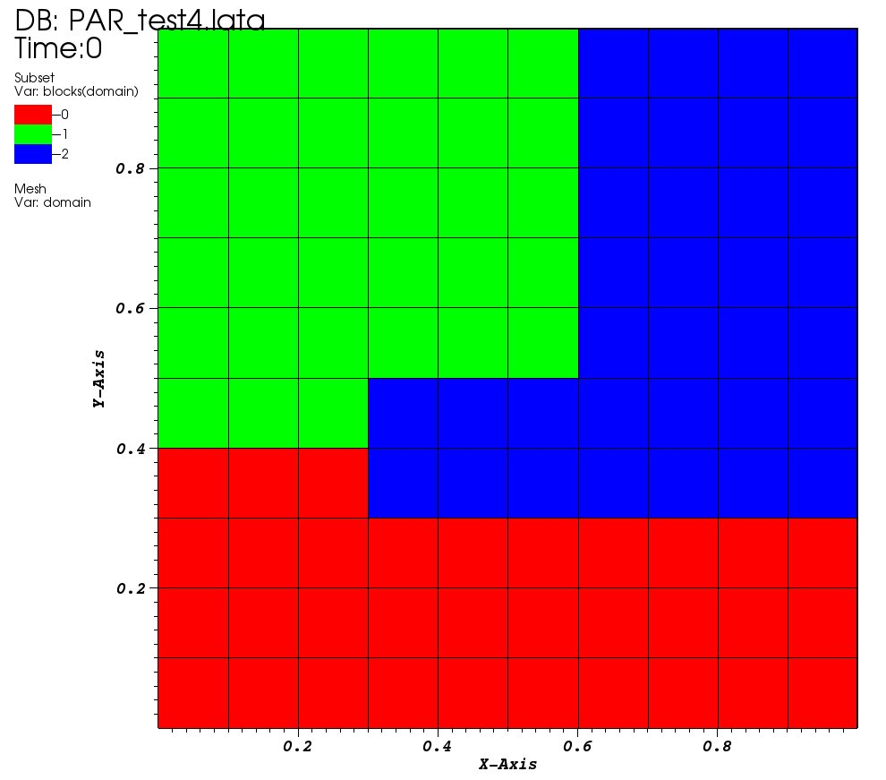
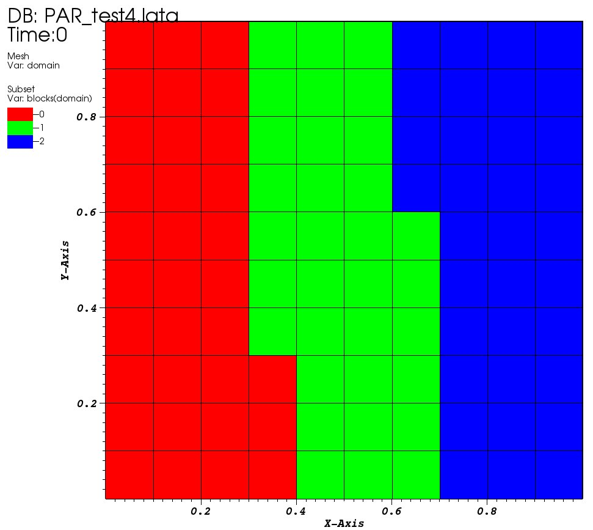

Parallel Simulations
====================

**TRUST** is a plateform which allows to make parallel calculation following some basic rules:

-  **S**\ ingle **P**\ rogram, **M**\ ultiple **D**\ ata model: tasks are split up and run simultaneously on multiple processors with different input in order to obtain results faster.

-  messages exchange by **M**\ essage **P**\ assing **I**\ nterface.

-  from a PC to a massively parallel computer, with shared or distributed memory.

Basic Notions
-------------

To make a parallel calculation, you have to partition your domain. Each sub-domain will be treated by one processor. In order to have good performances, ensure you that:

-  sub-domains have almost the same number of cells.

-  joint lengths (boundaries between sub-domains) are minimal.

Performances
------------

You have to choose a number of processors which is in agreement with the number of cells. So, you can evaluate your speed-up (sequential time/parallel time which must be as close as possible of the number of processors) or efficiency (=1/SpeedUp) to choose the right number of processors.

From our experience, for good performance with **TRUST**, each processor has to treat between 20000 and 30000 cells.

Partitioning
------------

To run a parallel calculation, you must:

-  make some modifications on your *my_data_file.data* file,

-  do two runs:

   -  the first one, to partitioning and create your ’n’ sub-domains (two methods will by presented).

   -  the second one, to read your ’n’ sub-domains and run the calculation on ’n’ processors.

.. _decjdd:

The different blocks
~~~~~~~~~~~~~~~~~~~~

Different blocks appear in the data file.

-  **Modifications on the mesh block**
   
      First you may add the tags ``# BEGIN MESH #`` and ``# END MESH #`` before and after your mesh block, for example:

      .. code-block:: bash

         # BEGIN MESH #
         Read_file my_mesh.geo ;
         [Trianguler_h my_domain ]
         # END MESH #

      You can refer to section :ref:`Mesh` to have more information.

-  **Adding a partitioning block**

      You may now add the partitioning block which contains the cutting instruction, after your mesh block:

      .. code-block:: bash

         # BEGIN PARTITION
         Partition my_domain
         {
            Partition_tool partitioner_name { option1 option2 ... }
            Larg_joint 2
            zones_name DOM
            ...
         }
         End
         END PARTITION #

      Where *partitioner_name* is the name of the chosen partitioner, one of **METIS**, **Tranche**, **Sous_Zones**, **Partition** or **Fichier_Decoupage** (see section :ref:`partitioner`).

      The **Larg_joint** keyword allows to specify the overlapping width value.  

      **Note** the **End** before the last line. It will be useful for the cutting step.

      This block will make the partitioning of your domain into the specified number of sub-domains during the partitioning run.

-  **Adding a block to read the sub-domains**

      At last, you will add a block which will be activated during the parallel calculation and will allow to read the sub-domains:

      .. code-block:: bash

         # BEGIN SCATTER
         Scatter DOM .Zones my_domain
         END SCATTER #

.. _makePARdata:

Partitionning: "Assisted" method
~~~~~~~~~~~~~~~~~~~~~~~~~~~~~~~~

Here we will use the **trust -partition datafile** command line to make the partitioning step. We consider that you have correctly add the "#" in your *my_data_file.data* file with the partitioning block and cutting block.

**Be careful** with the hashtags "#", they are interpreted by the script!

To automatically perform the partitioning step and obtain the parallel data file, you have to run:

::

   > trust -partition my_data_file [parts_number]

.. note::

   Here parts_number is the number of sub-domains created but it is also the number of processors which will be used.

This command creates:

-  a *SEQ_my_data_file.data* file which is a backup file of *my_data_file.data* the sequential data file,

-  a *DEC_my_data_file.data* file which is the first data file to be run to make the partitioning. 

   It is immediately run by the command line **trust -partition datafile** to create a partition, located in the *DOM_000n*\ **.Zones** files.

   .. note::

      The code stops reading this file at the **End** keyword just before the **# END PARTITION #** block.

-  a *PAR_my_data_file.data* file which is the data file for the parallel calculation. It reads the *DOM_000n*\ **.Zones** files through the instruction **"Scatter"**.

   **Note** that the meshing and cut of the mesh are commented here.

To see your sub-domains, you can run:

::

   > trust -mesh PAR_my_data_file

For more information, you can do the exercise of the `TRUST Tutorial <https://github.com/cea-trust-platform/trust-code/blob/master/doc/TRUST/TRUST_tutorial.pdf>`__.

.. _partitioner:

**TRUST** available partitioning tools
~~~~~~~~~~~~~~~~~~~~~~~~~~~~~~~~~~~~~~

In **TRUST**, you can make partitioning with:

-  the external partitionning library `METIS <http://glaros.dtc.umn.edu/gkhome/views/metis>`__ (open source). 

   It is a general algorithm that will generate a partition of the domain

   .. code-block:: bash

      Partition_tool Metis 
      {
         nb_parts N
         [use_weights]
         [pmetis | kmetis]
         [nb_essais N]
      }

-  internal **TRUST** partitioning tool **Tranche** which makes parts by cutting the domain following x, y and/or z directions.

     .. code-block:: bash

      partition_tool Tranche 
      {
         tranches nx ny [nz]
      }

Figure 3 is an example of what you can obtain by cutting a 1m x 1m square, divided in three parts using `METIS <http://glaros.dtc.umn.edu/gkhome/views/metis>`__ and the same
square divided in Figure 4 into three slices following the x direction with **Tranche**.

   Figure 3: METIS partition.

   Figure 4: TRANCH partition.

.. raw:: html

   

For more information, see the `TRUST Reference Manual <https://github.com/cea-trust-platform/trust-code/blob/master/doc/TRUST/TRUST_Reference_Manual.pdf>`__.

Overlapping width value
~~~~~~~~~~~~~~~~~~~~~~~

To make the partitioning, you will have to specify the *overlapping width value*. This value corresponds to the thickness of the virtual ghost zone (data known by one processor though not owned by it) i.e. the number of vertices or elements on the remote sub-domain known by the local sub-domain (see Figure 5).

.. container:: center

   .. figure:: images/overlap.jpeg
      :alt: Overlapping width   
      :width: 700px
      :align: center
      :figclass: small-caption

      Figure 5: Overlapping width.

This value depends on the space discretization scheme orders:

-  1 if 1st or 2nd order.

-  2 if 3rd or 4th order.

**Note** that in general, you will use "2"!

Running a Parallel Calculation
------------------------------

On a PC
~~~~~~~

To launch the calculation, you have to run the calculation by the usual command completed by the number of processors needed:

::

   > trust my_parallel_data_file procs_number

and *procs_number* is the number of processors used. In fact it is the same as the number of sub-domains.

You can see the **TRUST**\ & **TrioCFD** user slides in the "Parallel calculation" section for more information. Also work the exercises in the `TRUST Tutorial <https://github.com/cea-trust-platform/trust-code/blob/master/doc/TRUST/TRUST_tutorial.pdf>`__.

On a cluster
~~~~~~~~~~~~

You must submit your job in a queue system. For this, you must have a submission file. **TRUST** can create a submission file for you **on clusters on which the support team has done installations**. 

To create this file, run:

::

   > trust -create_sub_file my_parallel_data_file

You obtain a file named **sub_file**, you can open it and verify/change values(for example the name of the job, the name of the exe, ...).

Then you must submit you calculation with:

::

   > sbatch sub_file

or

::

   > ccc_msub sub_file

following the queue system of the cluster.

You can see the **TRUST**\ & **TrioCFD** user slides in the "Parallel calculation" section for more information.

.. _visualization-1:

Visualization
-------------

To visualize your probes, you can use the CurvePlot tool, with the command line:

::

   > trust -evol my_parallel_data_file

or use Gnuplot or any software which reads values in columns in a file.

There are three ways to visualize your parallel results with VisIt:

-  HPCDrive or Nice DCV on CCRT/TGCC clusters: opens a deported graphic session on dedicated nodes with more memory (on TGCC cluster: `HPCDrive <https://visu-tgcc.ccc.cea.fr/HPCDrive/home>`__),

-  local mode: copy your results from the cluster to your local computer and open it with a local parallel version of VisIt with:

   ::

      > visit -np 4 &

You can have a look at the **TRUST**\ & **TrioCFD** user slides in the "Parallel calculation description" section.

Useful Information
------------------

Modify the mesh
~~~~~~~~~~~~~~~

If you want to modify your mesh, you have two possibilities:

-  modify the *my_data_file.data* file and run:

   ::

      > trust -partition my_data_file [parts_number]

   Be carefull it will erase the *SEQ_my_data_file.data*, *DEC_my_data_file.data* and *PAR_my_data_file.data* files and creates new ones.
   
   Then it will run the new *DEC_my_data_file.data* file which gives your new *DOM_000n*\ **.Zones** files.

-  modify the meshing part of file *DEC_my_data_file.data* and run it with:

   ::

      > trust DEC_my_data_file

Then run the parallel calculation normally, on the new *DOM_000n*\ **.Zones** files.

::

   > trust PAR_my_data_file procs_number

Modify calculation parameters
~~~~~~~~~~~~~~~~~~~~~~~~~~~~~

If you want to modify the calculation parameters, you can modify:

-  the file *my_data_file.data* and run:

   ::

      > trust -partition data_file_name [parts_number]

   But it will erase the *SEQ_my_data_file.data*, *DEC_my_data_file.data* and *PAR_my_data_file.data* files and create new ones.
   
   Then it will run the new *DEC_my_data_file.data* file which gives your new *DOM_000n*\ **.Zones** files.
   
   .. note::

      In that case, you don’t need to re-create the mesh so you can use the second point below:

-  modify the *PAR_my_data_file.data* file *without* running **trust -partition datafile** command line.

Then run the *PAR_my_data_file.data* file with:

::

   > trust PAR_my_data_file procs_number

.. note::

   If after a certain time, you want to reopen an old case and understand want you did in it without any doubts, you may create two files by hands:

   -  one "BuildMeshes.data" file only for the mesh and the cut of the mesh.

   -  one "calculation.data" file for the parallel calculation.

You will run it like:

::

   > trust BuildMeshes
   > trust calculation processors_number
